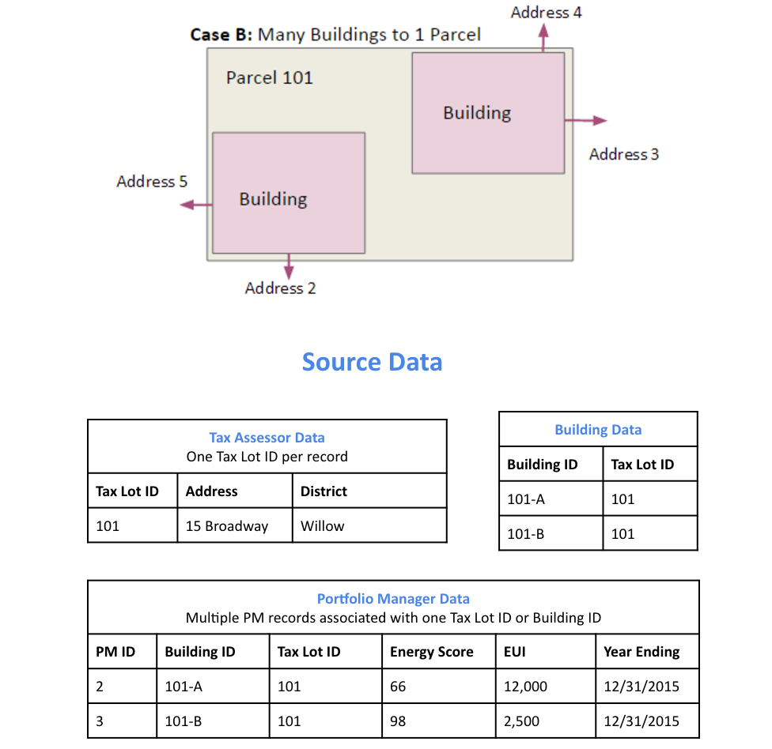
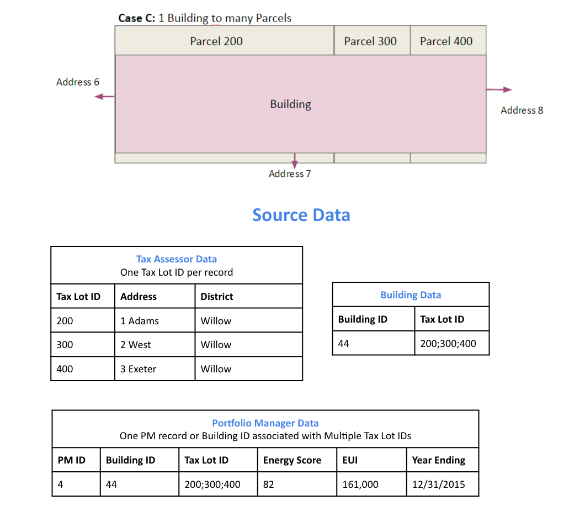
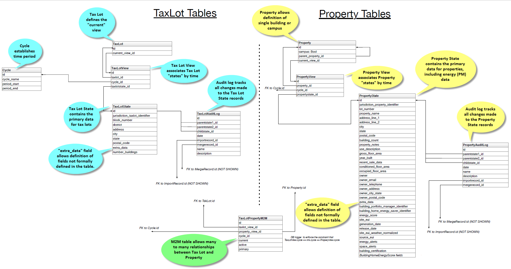

Data Model
==========

.. image:: images/case-a.png

.. image:: images/case-d.png

.. todo:: Documentation below is out of state and needs updated.

Our primary data model is based on a tree structure with BuildingSnapshot
instances as nodes of the tree and the tip of the tree referenced by a
CanonicalBuilding.

Take the following example: a user has loaded a CSV file containing information
about one building and created the first BuildingSnapshot (BS0). At this point
in time, BS0 is linked to the first CanonicalBuilding (CB0), and CB0 is also
linked to BS0.

.. code-block:: shell

    BS0 <-- CB0
    BS0 --> CB0

These relations are represented in the database as foreign keys from the
BuildingSnapshot table to the CanonicalBuilding table, and from the
CanonicalBuilding table to the BuildingSnapshot table.

The tree structure comes to fruition when a building, BS0 in our case, is
matched with a new building, say BS1, enters the system and is auto-matched.

Here BS1 entered the system and was matched with BS0. When a match occurs,
a new BuildingSnapshot is created, BS2, with the fields from the existing
BuildingSnapshot, BS0, and the new BuildingSnapshot, BS1, merged
together. If both the existing and new BuildingSnapshot have data for a
given field, the new record's fields are preferred and merged into the child, B3.

The fields from new snapshot are preferred because that is the newer of the
two records from the perspective of the system.  By preferring the most recent fields
this allows for evolving building snapshots over time.  For example, if an existing
canonical record has a Site EUI value of 75 and some changes happen to a building
that cause this to change to 80 the user can submit a new record with that change.

All BuildingSnapshot instances point to a CanonicalBuilding.

.. code-block:: shell

    BS0  BS1
      \ /
      BS2 <-- CB0

    BS0 --> CB0
    BS1 --> CB0
    BS2 --> CB0

parents and children
^^^^^^^^^^^^^^^^^^^^

BuildingSnapshots also have linkage to other BuildingSnapshots in order to
keep track of their *parents* and *children*. This is represented in the
Django model as a many-to-many relation from BuildingSnapshot to BuildingSnapshot.
It is represented in the PostgreSQL database as an additional seed_buildingsnapshot_children
table.

In our case here, BS0 and BS1 would both have *children* BS2, and BS2 would
have *parents* BS0 and BS1.

.. note::

    throughout most of the application, the ``search_buildings`` endpoint
    is used to search or list active building. This is to say, buildings that
    are pointed to by an active CanonicalBuilding.
    The ``search_mapping_results`` endpoint allows the search of buildings
    regardless of whether the BuildingSnapshot is pointed to by an active
    CanonicalBuilding or not and this search is needed during the mapping
    preview and matching sections of the application.

For illustration purposes let's suppose BS2 and a new building BS3 match to form a child BS4.

+--------+-------+
| parent | child |
+========+=======+
| BS0    | BS2   |
+--------+-------+
| BS1    | BS2   |
+--------+-------+
| BS2    | BS4   |
+--------+-------+
| BS3    | BS4   |
+--------+-------+

And the corresponding tree would look like:

.. code-block:: shell

    BS0  BS1
      \ /
      BS2  BS3
        \  /
         BS4 <-- CB0

    BS0 --> CB0
    BS1 --> CB0
    BS2 --> CB0
    BS3 --> CB0
    BS4 --> CB0

matching
--------

During the auto-matching process, if a *raw* BuildingSnapshot matches an
existing BuildingSnapshot instance, then it will point to the existing
BuildingSnapshot instance's CanonicalBuilding. In the case where there is no
existing BuildingSnapshot to match, a new CanonicalBuilding will be created, as
happened to B0 and C0 above.

+-------+--------+--------+-------------+
| field | BS0    | BS1    | BS2 (child) |
+=======+========+========+=============+
| id1   | **11** | 11     | 11          |
+-------+--------+--------+-------------+
| id2   |        | **12** | 12          |
+-------+--------+--------+-------------+
| id3   | **13** |        | 13          |
+-------+--------+--------+-------------+
| id4   | 14     | **15** | 15          |
+-------+--------+--------+-------------+

manual-matching vs auto-matching
^^^^^^^^^^^^^^^^^^^^^^^^^^^^^^^^

Since BuildingSnapshots can be manually matched, there is the possibility for
two BuildingSnapshots each with an active CanonicalBuilding to match and the
system has to choose to move only one CanonicalBuilding to the tip of the tree
for the primary BuildingSnapshot and *deactivate* the secondary
BuildingSnapshot's CanonicalBuilding.

Take for example:

.. code-block:: shell

    BS0  BS1
      \ /
      BS2  BS3
        \  /
         BS4 <-- CB0 (active: True)         BS5 <-- CB1 (active: True)

If a user decides to manually match BS4 and BS5, the system will take the
primary BuildingSnapshot's CanonicalBuilding and have it point to their
child and deactivate CB1. The deactivation is handled by setting a field
on the CanonicalBuilding instance, *active*, from ``True`` to ``False``.

Here is what the tree would look like after the manual match of **BS4** and
**BS5**:

.. code-block:: shell

    BS0  BS1
      \ /
      BS2  BS3
        \  /
         BS4  BS5 <-- CB1 (active: False)
           \  /
            BS6 <-- CB0 (active: True)

Even though BS5 is pointed to by a CanonicalBuilding, CB1, BS5 will not be
returned by the normal ``search_buildings`` endpoint because the
CanonicalBuilding pointing to it has its field ``active`` set to ``False``.

.. note::
    anytime a match is **unmatched** the system will create a new
    CanonicalBuilding or set an existing CanonicalBuilding's active field to
    ``True`` for any leaf BuildingSnapshot trees.

what really happens to the BuildingSnapshot table on import (and when)
^^^^^^^^^^^^^^^^^^^^^^^^^^^^^^^^^^^^^^^^^^^^^^^^^^^^^^^^^^^^^^^^^^^^^^

The above is conceptually what happens but sometimes the devil is in the details.
Here is what happens to the BuildingSnapshot table in the database when records
are imported.

Every time a record is added at least two BuildingSnapshot records are created.

Consider the following simple record:

+-------------+-------------+---------------------+-----------+--------------+
| Property Id | Year Ending | Property Floor Area | Address 1 | Release Date |
+=============+=============+=====================+===========+==============+
|  499045     | 2000        | 1234                | 1 fake st | 12/12/2000   |
+-------------+-------------+---------------------+-----------+--------------+

The first thing the user is upload the file.  When the user sees the
"Successful Upload!" dialog one record has been added to the
BuildingSnapshot table.

This new record has an id (73700 in this case) and a created and
modified timestamp.  Then there are a lot of empty fields and a
source_type of 0.  Then there is the extra_data column which contains
the contents of the record in key-value form:

:Address 1: "1 fake st"
:Property Id: "499045"
:Year Ending: "2000"
:Release Date: "12/12/2000"
:Property Floor Area: "1234"

And a corresponding extra_data_sources that looks like

:Address 1: 73700
:Property Id: 73700
:Year Ending: 73700
:Release Date:  73700
:Property Floor Area: 73700

All of the fields that look like _source_id are also populated
with 73700 E.G. owner_postal_code_source_id.

The other fields of interest are the organization field which
is populated with the user's default organization and the import_file_id
field which is populated with a reference to a data_importer_importfile record.

At this point the record has been created before the user hits the
"Continue to data mapping" button.

The second record (id = 73701) is created by the time the user gets to the screen
with the "Save Mappings" button.  This second record has the following fields populated:

- id
- created
- modified
- pm_property_id
- year_ending
- gross_floor_area
- address_line_1
- release_date
- source_type (this is 2 instead of 0 as with the other record)
- import_file_id
- organization_id.

That is all.  All other fields are empty.  In this case that is all that happens.

Now consider the same user uploading a new file from the next year that looks like

+-------------+-------------+---------------------+-----------+--------------+
| Property Id | Year Ending | Property Floor Area | Address 1 | Release Date |
+=============+=============+=====================+===========+==============+
|  499045     | 2000        | 1234                | 1 fake st | 12/12/2001   |
+-------------+-------------+---------------------+-----------+--------------+

As before one new record is created on upload.  This has id 73702 and follows the same
pattern as 73700.  And similarly 73703 is created like 73701 before the "Save Mappings"
button appears.

However this time the system was able to make a match with an existing record.
After the user clicks the "Confirm mappings & start matching" button a new record
is created with ID 73704.

73704 is identical to 73703 (in terms of contents of the BuildingSnapshot table only)
with the following exceptions:

- created and modified timestamps are different
- match type is populated and has a value of 1
- confidence is populated and has a value of .9
- source_type is 4 instead of 2
- canonical_building_id is populated with a value
- import_file_id is NULL
- last_modified_by_id is populated with value 2 (This is a key into the landing_seeduser table)
- address_line_1_source_id is 73701
- gross_floor_area_source_id is populated with value 73701
- pm_property_id_source_id is populated with 73701
- release_date_source_id is populated with 73701
- year_ending_source_id is populated with 73701

what really happens to the CanonicalBuilding table on import (and when)
^^^^^^^^^^^^^^^^^^^^^^^^^^^^^^^^^^^^^^^^^^^^^^^^^^^^^^^^^^^^^^^^^^^^^^^

In addition to the BuildingSnapshot table the CanonicalBuilding table is also updated
during the import process.  To summarize the above 5 records were created in the
BuildingSnapshot table:

1. 73700 is created from the raw 2000 data
2. 73701 is the mapped 2000 data,
3. 73702 is created from the raw 2001 data
4. 73703 is the mapped 2001 data
5. 73704 is the result of merging the 2000 and 2001 data.

In this process CanonicalBuilding is updated twice.  First when the 2000 record is imported the
CanonicalBuilding gets populated with one new row at the end of the matching step.
I.E. when the user sees the "Load More Data" screen.  At this point there is a new row that looks like

+--------+--------+-----------------------+
|   id   | active | canonical_building_id |
+========+========+=======================+
| 20505  | TRUE   | 73701                 |
+--------+--------+-----------------------+

At this point there is one new canonical building and that is the BuildingSnapshot with
id 73701.  Next the user uploads the 2001 data.  When the "Matching Results" screen
appears the CanonicalBuilding table has been updated.  Now it looks like

+--------+--------+-----------------------+
|   id   | active | canonical_building_id |
+========+========+=======================+
| 20505  | TRUE   | 73704                 |
+--------+--------+-----------------------+

There is still only one canonical building but now it is the BuildingSnapshot record
that is the result of merging the 2000 and 2001 data:  id = 73704.

organization
^^^^^^^^^^^^

BuildingSnapshots belong to an Organization field that is a foreign key into the organization
model (orgs_organization in Postgres).

Many endpoints filter the buildings based on the organizations the requesting user
belongs to.  E.G. get_buildings changes which fields are returned based on the
requesting user's membership in the BuildingSnapshot's organization.

\*_source_id fields
^^^^^^^^^^^^^^^^^^^

Any field in the BuildingSnapshot table that is populated with data from a
submitted record will have a corresponding _source_id field.  E.G
pm_property_id has pm_property_id_source_id,
address_line_1 has address_line_1_source_id,
etc...

These are foreign keys into the BuildingSnapshot that is the source of that
value.  To extend the above table

+-------+--------+--------+-------------+------------------------+
| field | BS0    | BS1    | BS2 (child) | BS2 (child) _source_id |
+=======+========+========+=============+========================+
| id1   | **11** |        | 11          | BS0                    |
+-------+--------+--------+-------------+------------------------+
| id2   |        | **12** | 12          | BS1                    |
+-------+--------+--------+-------------+------------------------+

**NOTE:**  The BuildingSnapshot records made from the raw input file have all the
_source_id fields populated with that record's ID.  The non-canonical BuildingSnapshot
records created from the mapped data have none set.  The canonical BuildingSnapshot
records that are the result of merging two records have only the _source_id fields
set where the record itself has data.  E.G. in the above address_line_1 is set to
"1 fake st." so there is a value in the canonical BuildingSnapshot's address_line_1_source_id
field.  However there is no block number so block_number_source_id is empty.  This
is unlike the two raw BuildingSnapshot records who also have no block_number but
nevertheless have a block_number_source_id populated.

extra_data
^^^^^^^^^^

The BuildingSnapshot model has many "named" fields.  Fields like "address_line_1",
"year_built", and "pm_property_id".  However the users are allowed to submit files
with arbitrary fields.  Some of those arbitrary fields can be mapped to "named"
fields.  E.G. "Street Address" can usually be mapped to "Address Line 1".
For all the fields that cannot be mapped like that there is the extra_data field.

extra_data is Django json field that serves as key-value storage for other
user-submitted fields.  As with the other "named" fields there is a corresponding
extra_data_sources field that serves the same role as the other _source_id fields.
E.G. If a BuildingSnapshot has an extra_data field that looks like

:an_unknown_field: 1
:something_else: 2

It should have an extra_data_sources field that looks like

:an_unknown_field: some_BuildingSnapshot_id
:something_else: another_BuildingSnapshot_id

saving and possible data loss
^^^^^^^^^^^^^^^^^^^^^^^^^^^^^

When saving a Property file some fields that are truncated if too long.
The following are truncated to 255 characters

- jurisdiction_tax_lot_id
- pm_property_id
- custom_id_1
- ubid
- lot_number
- block_number
- district
- owner
- owner_email
- owner_telephone
- owner_address
- owner_city_state
- owner_postal_code

And the following are truncated to 255:

- property_name
- address_line_1
- address_line_2
- city
- postal_code
- state_province
- building_certification

No truncation happens to any of the fields stored in extra_data.
