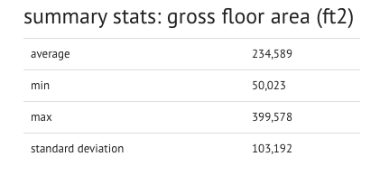

# demo-stats-app with Django

install the **stats** app

```pycon
pip install -e git+https://github.com/buildingenergy/seed_demo_app.git#egg=seed_demo_app
```

add `stats` to your Django setting's `INSTALLED_APPS`:

```py

INSTALLED_APPS += ('stats',)
```

add `stats` to your url routes:

```py
url(r'stats/', include('stats.urls', app_name='stats')),
```


go to `/stats/` in your browser...


that's it!


